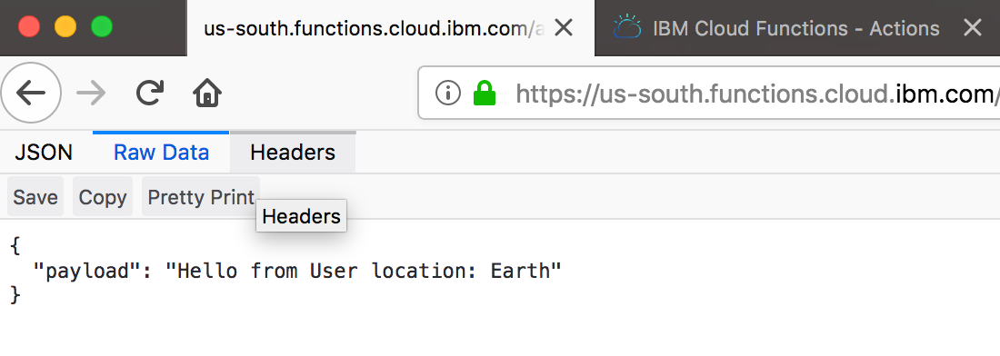
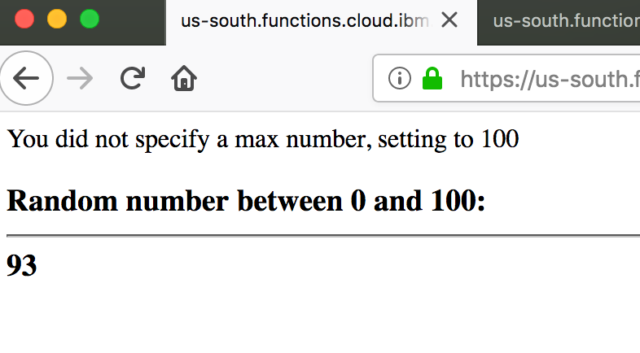

Repo for short Serverless JavaScript workshop, targetting IBM Cloud Functions platform

Prereq's:
1. Do the setup here: [Setup for workshop](https://github.com/prpatel/Serverless-Workshop-Setup-All-Platforms)
2. Make sure to have node 8+ installed

### 1. Test IBM Cloud Functions From The CLI

1. Run the following command to invoke a test function from the command-line.

   ```
   $ ibmcloud wsk action invoke whisk.system/utils/echo -p message hello --result
   {
       "message": "hello"
   }
   ```

*If you're using the local OpenWhisk instance, simply drop the 'ibmcloud' at the beginning of the command, and run the rest*

*If this command executes successfully, you have verified that the IBM Cloud CLI and Cloud Functions plugin have been installed and configured correctly. If this does not work, please contact the workshop organiser to provide assistance!*

### 2. Build and deploy your first Serverless JavaScript App!

From where you cloned this git repo:
1. node -v
2. ibmcloud fn action create helloJavaScript helloJavaScript.js
3. ibmcloud fn action invoke --result helloJavaScript --param name World

You should see:
{
    "greetings": "Hello! Welcome to OpenWhisk"
}

"--result" means just show the results. Omit that, and see what you get back :)
This also adds the "--blocking" flag, discussed below.

### 3. Get to know some OpenWhisk commands

* ibmcloud wsk list
    * note that "wsk" is used here instead of fn! The ibmcloud" command wraps the OpenWhisk "wsk" command with either "fn" or "wsk"!
* ibmcloud wsk action invoke --blocking helloJavaScript
    * this invokes the action in an sync fashion, you'll get a alot of text back, but you're interested in this:
    ***
        "activationId": "13a3f62589214b7da3f62589214b7d1e",
    ***
    * this is what you'll use to get the result back later!
* ibmcloud wsk action invoke helloJavaScript
    * this invokes the action in an sync fashion, with something called an activationId
        ***
            ok: invoked /_/helloJavaScript with id 5923d0321aa04fffa3d0321aa0cfffc2
        ***
        * this is what you'll use to get the result back later!
        * ibmcloud wsk activation result 5923d0321aa04fffa3d0321aa0cfffc2
        ***
                        
            {
                "greetings": "Hello! Welcome to OpenWhisk"
            }
        ***        
    * To  get the last invocation result: ibmcloud wsk activation result --last
    * To get everything (not just result): ibmcloud wsk activation get 5923d0321aa04fffa3d0321aa0cfffc2

    
* ibmcloud fn action update helloJavaScript helloJavaScript.js
    * This will update the Cloud Function!              

### 4. What about logs?

* Each activation has logs!
* ibmcloud wsk activation get --last
    * look for  "logs"
* I miss my "tail -f" ... how do I do that?
    * ibmcloud wsk activation poll
* Run the above in a separate terminal if you like

### 5. To the Web! Let's create Web actions
* To find the URL from which you can invoke an action use this command:
```
ibmcloud wsk action get helloJavaScript --url
```

* But hang on, we haven't told OpenWhisk we want it to be a Web Function! Runt this first:
```
ibmcloud fn action update helloJavaScript helloJavaScript.js --web true
```    

* Check that it's enabled by going to the [IBM Cloud Functions Console](https://console.bluemix.net/openwhisk/actions)


* Since this Cloud Function just returns JSON, we need to append ".json" to the URL. You can test this by using curl
```
curl -i https://us-south.functions.cloud.ibm.com/api/v1/web/SAMPLE_URL/default/helloJavaScript.json
```
Use the first command in this section to get the URL... don't forget to append .json !

* You can also just paste this URL into the browser!


### 6. Create a HTML Web Cloud Function
* Check out the sample webHello.js in this project
* Create a web-enabled Cloud Function using this command:
```
ibmcloud fn action create webHello webHello.js --web true 
```
* Use the command from the previous section to get its URL
``` 
ibmcloud wsk action get webHello --url
```
* Invoke it by pasting the URL into the browser. If you appended .json to it, you'll get the it in json format. Do not append .json to it - and you'll see an a message wrapped in an H3 tag!
* What about the name parameter this Cloud Function takes? Append this to the URL:
``` 
webHello?name=Pratik
```
Of course, put your name instead of mine :)

### 7. Using NPM libs in your Cloud Functions
* Demo project is in "using-npm-modules" folder
* Uses the "random" npm lib
* Uses webpack to produce a single bundle.js file to bundle all npm deps
* Deploy and run:
``` 
cd using-npm-modules
npm install
npm run build
```
When it asks to install webpack-cli, say 'yes'

*deploy:*
``` 
ibmcloud fn action create webRandom build/bundle.js --web true 
```

*run from console*
```
ibmcloud fn action invoke --result webRandom --param max 1000
```

* To run from the web browser, remember you can get the URL using this:
``` 
ibmcloud wsk action get helloJavaScript --url

--> https://us-south.functions.cloud.ibm.com/api/v1/web/YOUR_ORG_WILL_BE_HERE/default/webRandom
```

And you'll see output like this:



Check the code (index.js) to see what you can pass in as a parameter! (Remember to append to the URL, see above example)
### 8. Extra credit

#### You now have all the building blocks to create Serverless Applications! What next?
* Write unit tests for your serverless application. For the last example, you can run a unit testing by doing this:
``` 
npm run test
```
This in the "using-npm-modules" sample folder folder
* Use more npm libs by doing an npm install
    * Remember - serverless applications are supposed to lean n' mean! Don't use heavy libs, rely on the useful stuff OpenWhisk provides, or use 3rd party serverless apps

### Coming soon (for full day Serverless workshops)
0. Calling our Serverless fns from a Web application!
0. Using and examing Web Cloud Function HTTP request headers
0. Changing Web Cloud Function HTTP response headers
1. Using cloud db's for saving data
2. Using redis for in-memory storage of sessions
3. Sequencing for weaving together Serverless fns
4. Using an API Gateway for organizing endpoints
5. Layering Authentication on top
6. Advanced debugging
7. Much Much more!